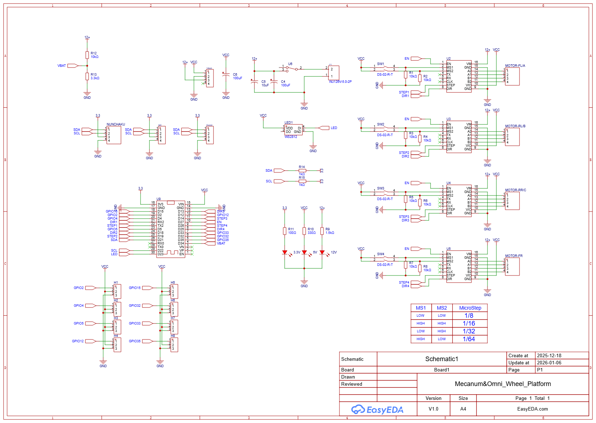

# 회로 설계

## 개요

이 프로젝트는 ESP32 DevKit보드 기반으로 TMC2209 스텝모터 드라이버를 통해 4개의 스텝모터를 제어합니다.

Wii Nunchaku 컨트롤러는 I2C 통신으로 연결되며
OLED 디스플레이는 실시간 상태 정보를 표시합니다.

배터리 전압 모니터링과 WS2812 LED를 통한 시각적 피드백 기능도 포함되어 있습니다.

 
 

## 회로 구성 요소

- **ESP32 DevKit**: 메인 컨트롤러로 Wi-Fi 및 Bluetooth 기능을 제공합니다.
- **TMC2209 스텝모터 드라이버**: 4개의 스텝모터를 제어하며, 조용한 작동과 고정밀 제어를 지원합니다.
- **Wii Nunchaku 컨트롤러**: I2C 통신을 통해 ESP32와 연결되어 로봇의 움직임을 제어합니다.
- **OLED 디스플레이**: I2C 인터페이스를 통해 실시간 상태 정보를 표시합니다.
- **WS2812 LED**: 시각적 피드백을 제공하여 로봇의 상태를 쉽게 파악할 수 있습니다.

 

 

 

상세 회로와 보드 파일은 아래 링크에서 확인할 수 있습니다:

https://oshwlab.com/pashiran/mecanum-omni_wheel_platform

 

## PCB 제작

gerber 폴더에 거버 파일이 있습니다. 다른 수정 없이 zip 파일을 그대로 PCB 제작 업체에 전송하여 제작할 수 있습니다.

 

  

### 필요 부품

아래 링크는 참조용이며, 동일한 사양의 부품이면 다른 제품을 사용해도 무방합니다.

#### 1.ESP32 DevKit 보드
https://www.aliexpress.com/item/1005008202808521.html

#### 2.TMC2209 스텝모터 드라이버 4개

https://www.aliexpress.com/item/1005005816767597.html

- 보다 가격이 저렴한 A4988 / DRV8825 드라이버도 사용 가능합니다. 
다만 이 회로는 TMC2209 기준으로 제작되어 있어 마이크로스테핑 점퍼 핀(MS3) 을 직접 선으로 납땜해야 합니다. 

#### 3.OLED 디스플레이 (I2C 방식)

https://www.aliexpress.com/item/1005006141235306.html

#### 4.WS2812 LED

https://www.aliexpress.com/item/4001345875756.html

#### 5.DC-DC 컨버터 모듈 (12V to 5V)

https://www.aliexpress.com/item/1005007369519036.html

#### 6.2p 터미널

https://www.aliexpress.com/item/1005006642865467.html

#### 7.LED 3mm

https://www.aliexpress.com/item/1005003337160679.html

#### 8.토글 스위치

https://www.aliexpress.com/item/33012530737.html
#### 9.XH2.54 커넥터 4P

https://www.aliexpress.com/item/1005004732657004.html

#### 10.DIP 스위치 2way
https://ko.aliexpress.com/item/1005005908644654.html

#### 11.저항 및 커패시터

저항 : 100, 330, 1k, 1.5k, 10k, 15k, 39k
캐패시터 10uF, 100uF

## 참조

12-to-5V DC-DC 컨버터 모듈은 아래 제품을 사용했습니다. 전압 설정 방법은 상품 상세 설명에 나와 있으며, 하단의 adj 패턴을 잘라내고 5V 점퍼 패턴을 납땜하면 됩니다. 
기타 적당한 DC-DC 컨버터 모듈을 사용해도 상관 없습니다. 
단순히 7805 레귤레이터를 사용해도 됩니다. 

 

 

https://ko.aliexpress.com/item/1005007369519036.html

 

DC-DC 컨버터는 아래 위치에 사용됩니다. 
 

