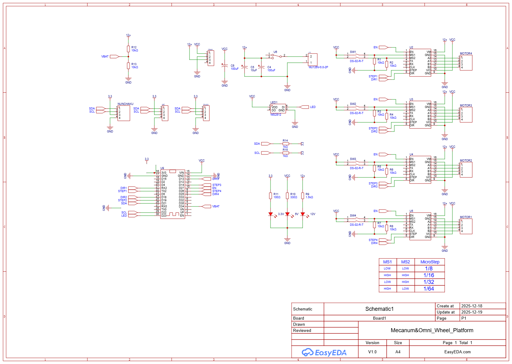

# 회로 설계

## 개요

이 프로젝트는 ESP32 DevKit보드 기반으로 TMC2209 스텝모터 드라이버를 통해 4개의 스텝모터를 제어합니다.
Wii Nunchaku 컨트롤러는 I2C 통신으로 연결되며
OLED 디스플레이는 실시간 상태 정보를 표시합니다.
배터리 전압 모니터링과 WS2812 LED를 통한 시각적 피드백 기능도 포함되어 있습니다.

## 회로 구성 요소

- **ESP32 DevKit**: 메인 컨트롤러로, Wi-Fi 및 Bluetooth 기능을 제공합니다.
- **TMC2209 스텝모터 드라이버**: 4개의 스텝모터를 제어하며, 조용한 작동과 고정밀 제어를 지원합니다.
- **Wii Nunchaku 컨트롤러**: I2C 통신을 통해 ESP32와 연결되어 로봇의 움직임을 제어합니다.
- **OLED 디스플레이**: I2C 인터페이스를 통해 실시간 상태 정보를 표시합니다.
- **WS2812 LED**: 시각적 피드백을 제공하여 로봇의 상태를 쉽게 파악할 수 있습니다.

