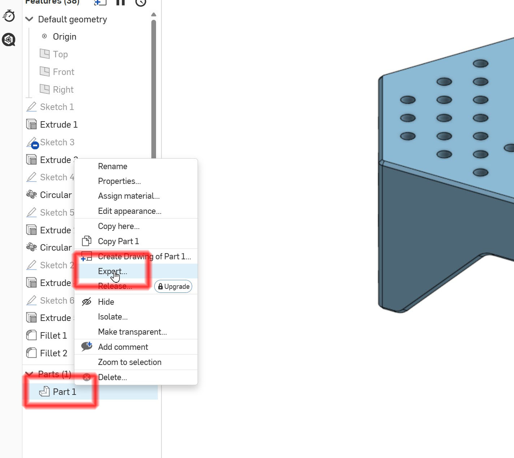

# 3D 하드웨어 및 제작, 조립

## 개요

이 프로젝트는 3D 프린터를 활용하여 로봇 섀시와 휠 마운트를 제작합니다.

메카넘 휠 및 옴니휠을 장착하기 위한 구조물과 전자 부품을 고정하기 위한 브래킷을 포함합니다.

구동 모터는 NEMA17 스텝모터를 사용하며, TMC2209 스텝모터 드라이버로 제어됩니다.

NEMA17모터의 기본 크기 때문에 맞는 바퀴를 찾기 어려워, 직접 설계 및 제작되었습니다. 

## 3D 설계

이 프로젝트는 OnShape로 설계되었으며, 공개 링크는 다음과 같습니다:

https://cad.onshape.com/documents/ff57bdec1c6d6779bf98a37f/w/822729bdbaf3735bbfd197a1/e/99650087abd6c72c45d13ea9

## 메카넘 휠과 옴니 휠 제작

🛒 구매하는 경우 (추천)

전체 제작 난이도가 매우 상승하는 관계로 구매를 추천합니다.

https://ko.aliexpress.com/item/1005007408718710.html

https://ko.aliexpress.com/item/1005008999375110.html

보유하고 있는 스텝모터 축 지름에 맞는 제품을 구입해야 합니다. 
보통 5mm, 6mm 이지만 가끔 6.35mm (1/4 inch) 도 있으니 확인하여 구매 바랍니다.

🖨️ 출력 제작하는 경우

메카넘 휠과 옴니휠 OnShape 링크는 다음과 같습니다

https://cad.onshape.com/documents/c310c3effb38c7f3acc79f58/w/c07cc897fb06c8a4155324c2/e/7e88b5236d8c2297355b210d

### 출력용 파일 다운로드

출력을 원하는 어셈블리/파트에 오른쪽 마우스 클릭 후 export 를 선택하면 step, stl 등 여러 포맷으로 다운로드 가능합니다. 

메카넘 휠과 옴니 휠의 지름, 휠 두께 및 보조바퀴 수 등은 파라메트릭으로 설계되어 있습니다. 

사용 목적에 맞게 치수를 변경하여 쉽게 재설계할 수 있습니다. 

TPU 인쇄의 편리성을 위해 작은 바퀴의 바깥 부분은 분리되어 있습니다. 

TPU를 사용하지 않을 경우 그냥 붙여서 인쇄하면 한 덩어리로 인쇄됩니다. 

## 필요 부품 목록

### 인서트 너트

https://ko.aliexpress.com/item/1005003582355741.html

M3

### PCB 스페이서 

https://ko.aliexpress.com/item/1005008237420603.html

M3 10mm

### 플렌지 커플러

바퀴를 직접 출력하는 경우, 모터와 바퀴의 연결을 위해 추가적으로 플렌지 커플러가 필요합니다.

https://ko.aliexpress.com/item/4000221287535.html

갖고 있는 스텝모터의 축 지름에 맞춰 구입합니다. 
보통은 6mm 이나 특정 모델은 6.35, 혹은 5mm 일 수 있으니 확인 후 구입 바랍니다. 

### NEMA17 스텝모터

알리에서 NEMA17 스텝모터로 검색하면 다양한 제품이 나옵니다. 

케이블이 포함된 제품을 구입하는 것이 편리합니다. 

## 바퀴 출력시 필요한 추가 부품

### 셀프 테핑 볼트

https://ko.aliexpress.com/item/1005006212097286.html

M2x5 / M3x14

### 황동선

https://ko.aliexpress.com/item/1005006242551699.html

2x100mm or 2x150mm 
구리선은 작은 바퀴의 축으로 사용됩니다.

펜치 등으로 손쉽게 절단 가능합니다.

 
 

### 전원

배터리 전원 관리의 편의성을 위해 전동공구용 배터리를 사용했습니다. 

12V 이상의 다른 전원을 사용할 수도 있지만, 순간적으로 4~5A 이상의 전류가 필요할 수 있으므로 충분한 전류 용량을 가진 전원을 사용해야 합니다.

#### 배터리

https://ko.aliexpress.com/item/1005009797639518.html

#### 배터리 커넥터

https://ko.aliexpress.com/item/1005008571735438.html

#### 충전기

https://ko.aliexpress.com/item/1005009966591053.html
