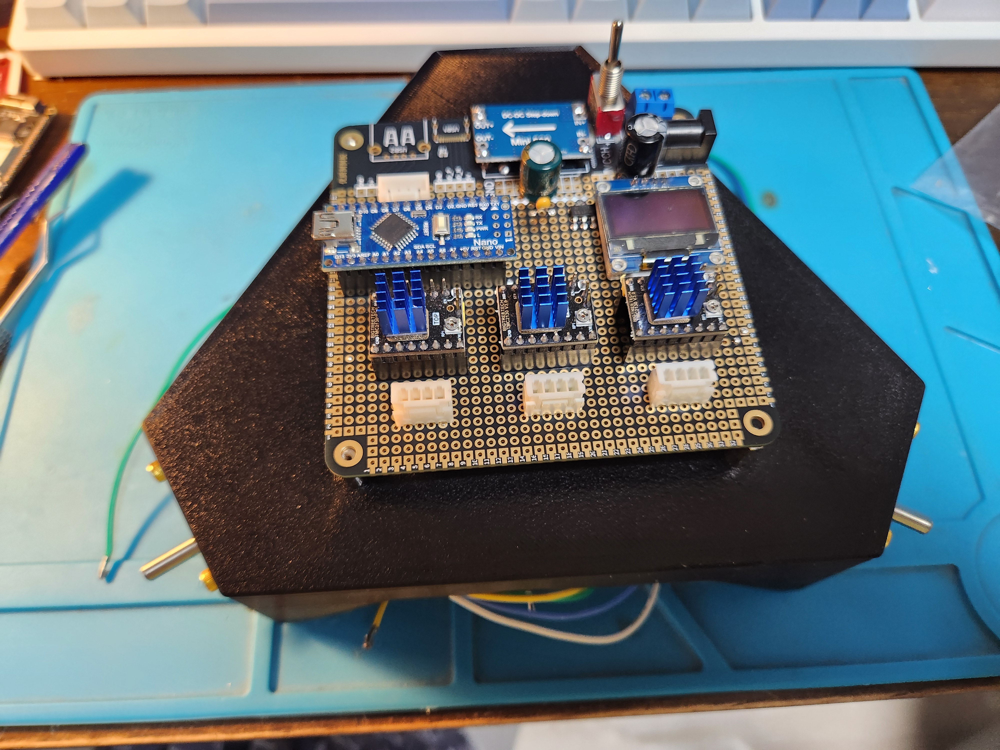
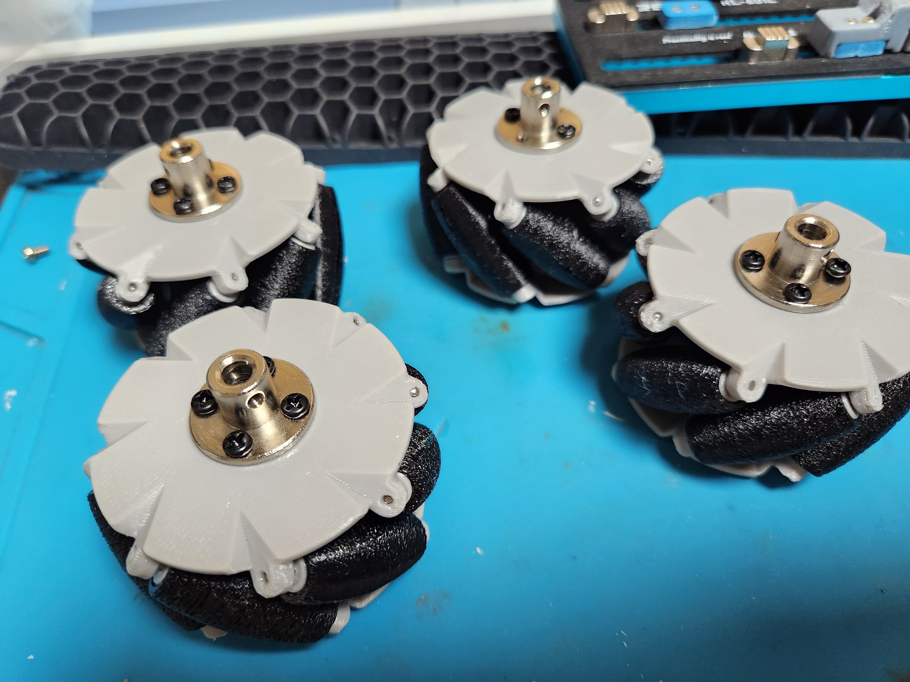
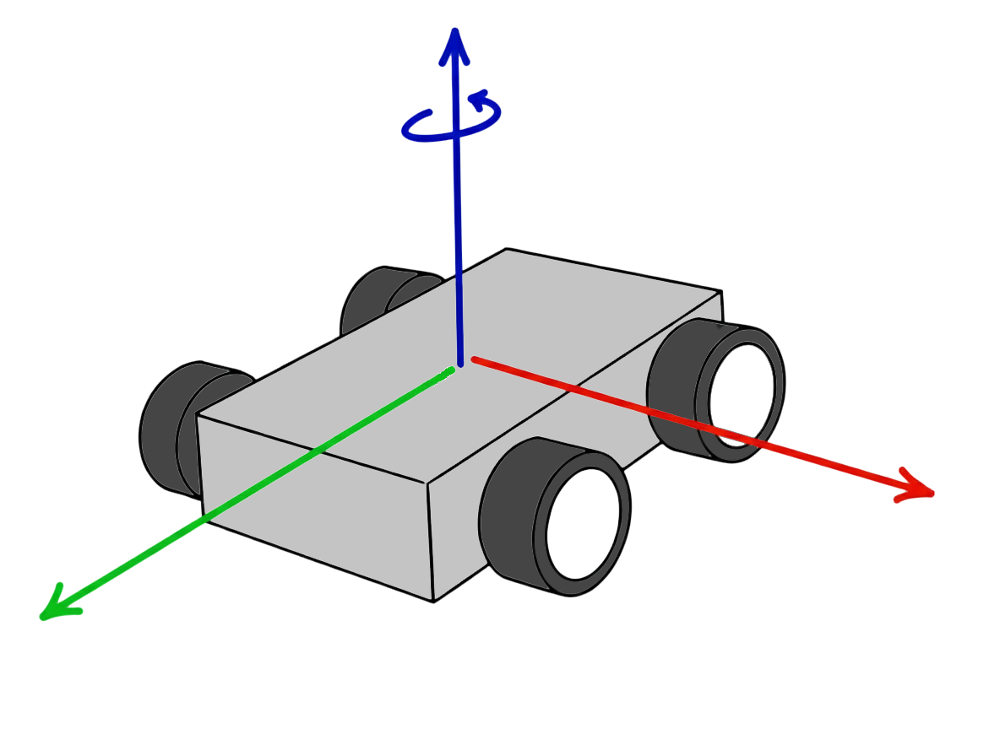
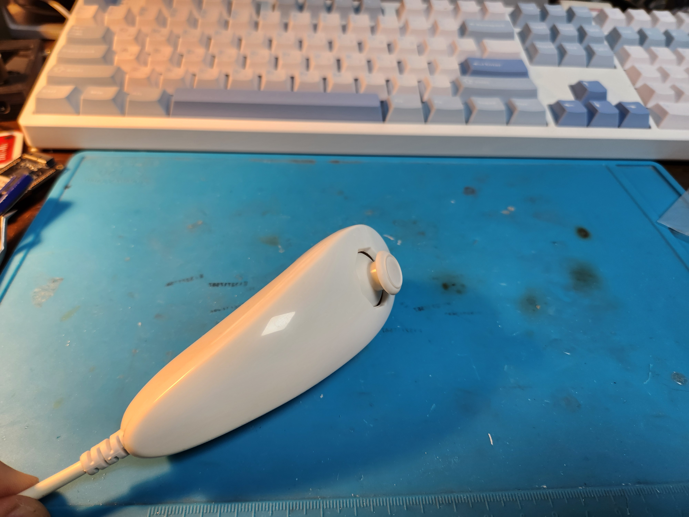
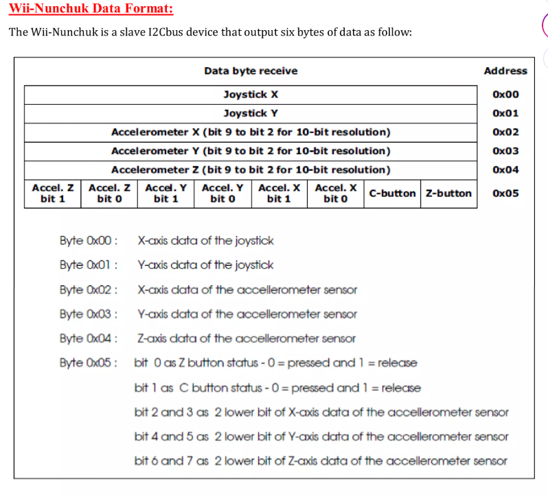
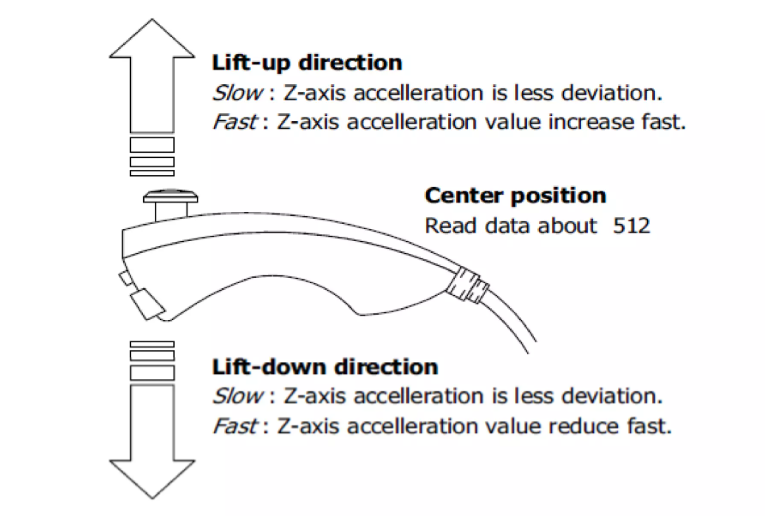
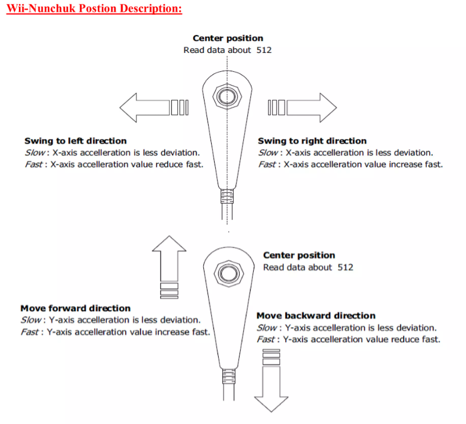

# Nunchaku-controlled Mecanum/Omni Wheel Robot

Wii Nunchaku 컨트롤러를 사용하여 메카넘 휠 및 옴니휠 로봇 베이스를 제어하는 프로젝트입니다.

## 개요

더 많은 이미지 보기

## Kinematics

이 프로젝트는 Wii Nunchaku의 조이스틱과 가속도 센서를 활용하여 메카넘 휠 또는 옴니휠이 장착된 로봇의 전방향 이동을 직관적으로 제어합니다.

XYZ 3방향 이동과 Z축 회전(yaw)을 조합하여 로봇의 움직임을 제어합니다. 

- **3각형 바디 베이스**: 3개의 스텝모터와 옴니휠
- **4각형 바디 베이스**: 4개의 스텝모터와 메카넘 휠
- Arduino를 이용해 제어
- OLED 디스플레이 포함
- 스텝모터 드라이버: TMC2209

### 메카넘 휠과 옴니 휠

- **메카넘 휠(Mecanum Wheel)**: 45도 각도로 배치된 롤러를 가진 특수 휠로, 4개의 휠을 독립적으로 제어하여 전후좌우 이동과 제자리 회전, 대각선 이동이 가능합니다.
- **옴니 휠(Omni Wheel)**: 휠 둘레에 수직으로 배치된 작은 롤러를 가진 휠로, 3개 이상의 휠을 조합하여 전방향 이동이 가능합니다.

#### 메카넘 휠의 거동의 수학적 정리
# 🧠 메카넘 휠 차량의 바퀴 회전수 계산식

## ⚙️ 1️⃣ 기본 설정

- **휠의 지름:** \( W_d \)  
  → 휠 반지름 \( r = \frac{W_d}{2} \)

- **휠 간격**
  - 좌우 간격: \( X_{d_w} \)
  - 전후 간격: \( Y_{d_w} \)

- **차체 좌표계**
  - \( +X \): 전진 방향  
  - \( +Y \): 왼쪽 방향  
  - \( +Z \): 위쪽 (회전축)

- **휠 위치**
  - FL (Front Left), FR (Front Right), RL (Rear Left), RR (Rear Right)

---

## ⚙️ 2️⃣ 차체 속도 벡터

\[
\begin{bmatrix}
v_x \\ v_y \\ \omega_z
\end{bmatrix}
\]

- \( v_x \): X 방향 속도 (전진)
- \( v_y \): Y 방향 속도 (측면 이동)
- \( \omega_z \): Z축 회전 속도 (Yaw rate)

##### Wii Nunchaku 개요

닌텐도의 Wii Nunchaku는 2006년에 발매된 Nintendo Wii의 조이스틱과 가속도 센서를 포함한 컨트롤러입니다. I2C 방식으로 신호를 주고받으며 아두이노 라이브러리를 통해 제어할 수 있습니다. 

