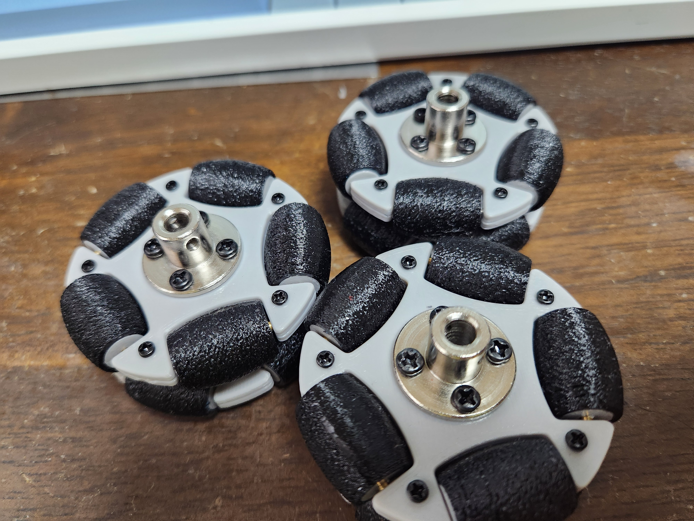
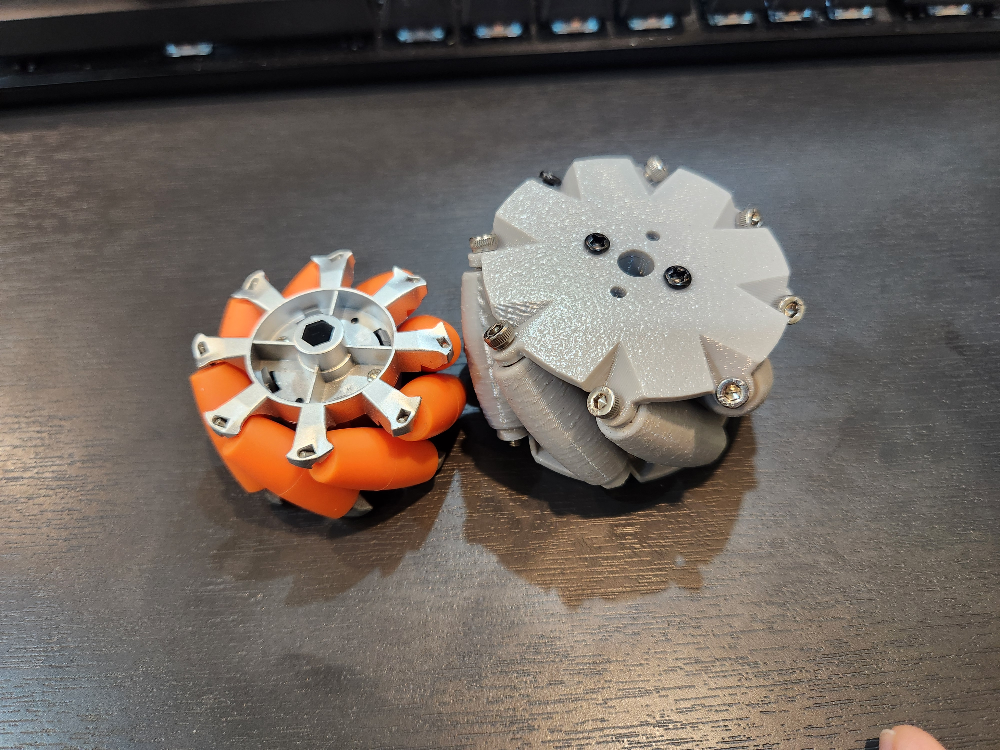
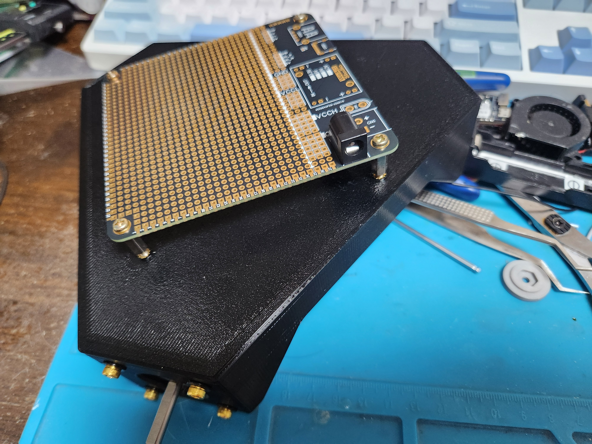
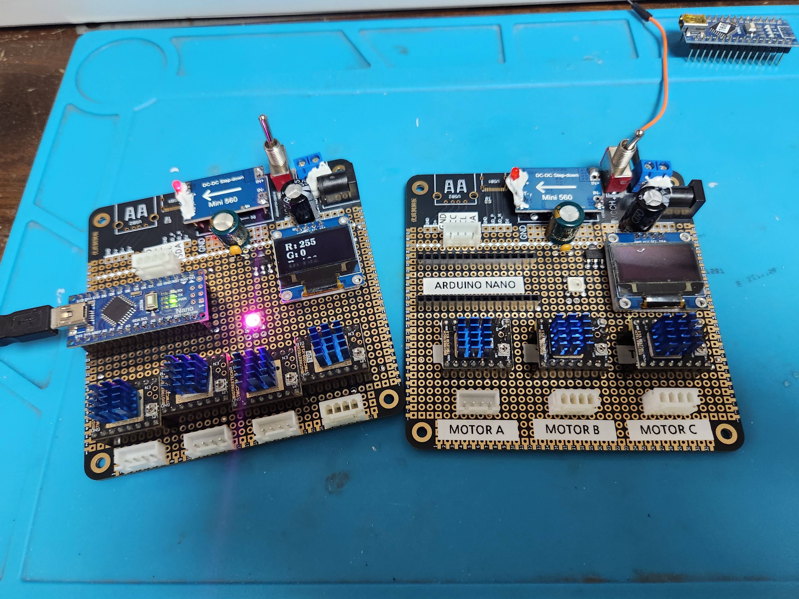
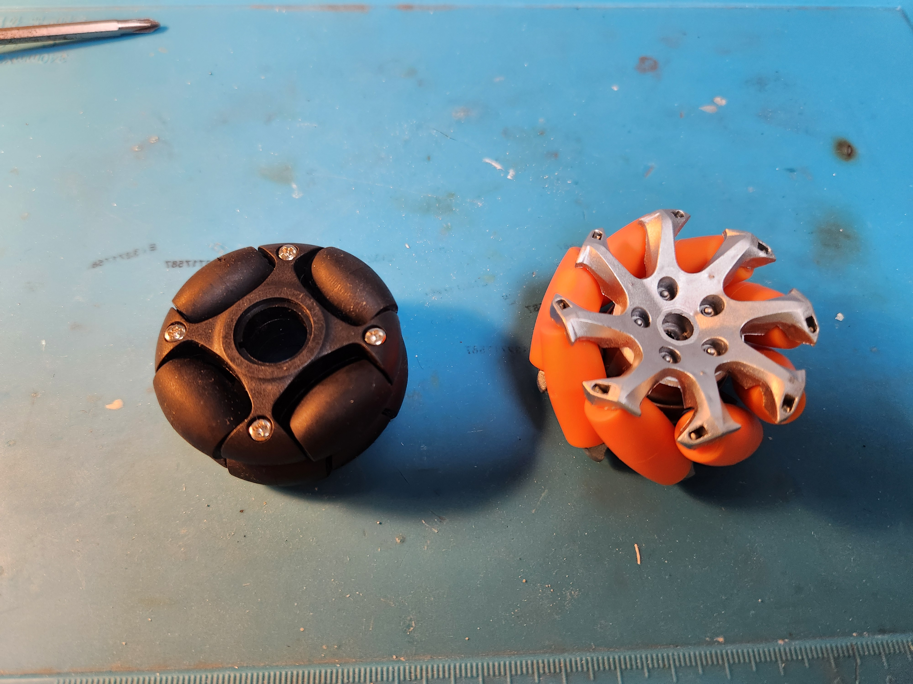

# Nunchaku-controlled Mecanum/Omni Wheel Robot

Wii Nunchaku 컨트롤러를 사용하여 메카넘 휠 및 옴니휠 로봇 베이스를 제어하는 프로젝트입니다.

 

## 개요

더 많은 이미지 보기

 
 
 

## 메카넘 휠과 옴니 휠

**메카넘 휠(Mecanum Wheel)**(우측): 

45도 각도로 배치된 롤러를 가진 특수 휠로, 
4개의 휠을 독립적으로 제어하여 전후좌우 이동과 제자리 회전, 대각선 이동이 가능합니다.
 

**옴니 휠(Omni Wheel)**(좌측): 

휠 둘레에 수직으로 배치된 작은 롤러를 가진 휠로, 
3개 이상의 휠을 조합하여 전방향 이동이 가능합니다.

 
 

### Kinematics

이 프로젝트는 Wii Nunchaku의 조이스틱과 가속도 센서를 활용하여 메카넘 휠 또는 옴니휠이 장착된 로봇의 전방향 이동을 직관적으로 제어합니다.

XYZ 3방향 이동과 Z축 회전(yaw)을 조합하여 로봇의 움직임을 제어합니다. 

차체의 거동에 관한 수학적 계산은 [Mecanum_calc.md](Mecanum_calc.md)와 [OmniWheel_calc.md](OmniWheel_calc.md)를 참조하세요.

- **3각형 바디 베이스**: 3개의 스텝모터와 옴니휠
- **4각형 바디 베이스**: 4개의 스텝모터와 메카넘 휠
- Arduino를 이용해 제어
- OLED 디스플레이 포함
- 스텝모터 드라이버: TMC2209

 
 

### Wii Nunchaku 개요

닌텐도의 Wii Nunchaku는 2006년에 발매된 Nintendo Wii의 조이스틱과 가속도 센서를 포함한 컨트롤러입니다. 
I2C 방식으로 신호를 주고받으며 아두이노 라이브러리를 통해 제어할 수 있습니다. 

  

## 3D 하드웨어 및 제작, 조립

자세한 하드웨어 제작 및 조립 과정은 [Hardware_Assembly.md](Hardware_Assembly.md)를 참조하세요.
  

### 컨트롤러 및 회로

자세한 회로 설계는 [Circuit_Design.md](Circuit_Design.md)를 참조하세요.
  

