# Nunchaku-controlled Mecanum/Omni Wheel Robot

Wii Nunchaku 컨트롤러를 사용하여 메카넘 휠 및 옴니휠 로봇 베이스를 제어하는 프로젝트입니다.

 

## 개요

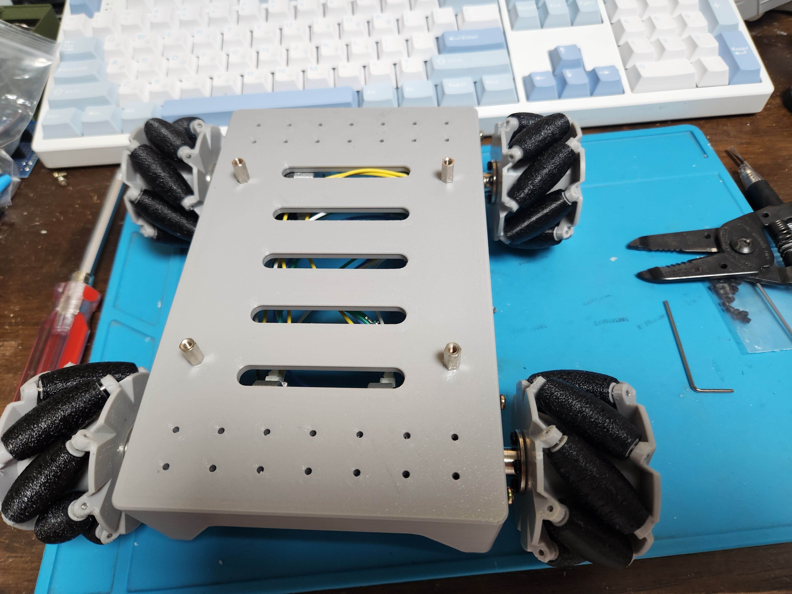

더 많은 이미지 보기

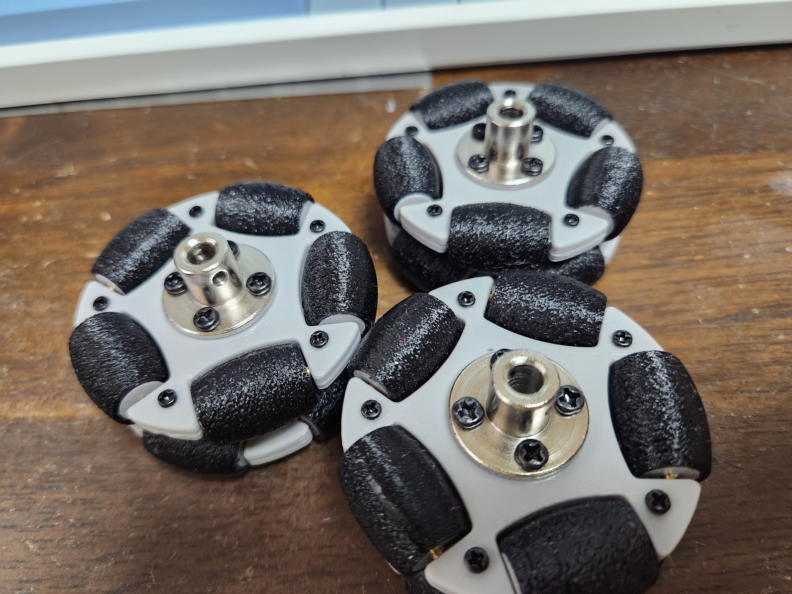
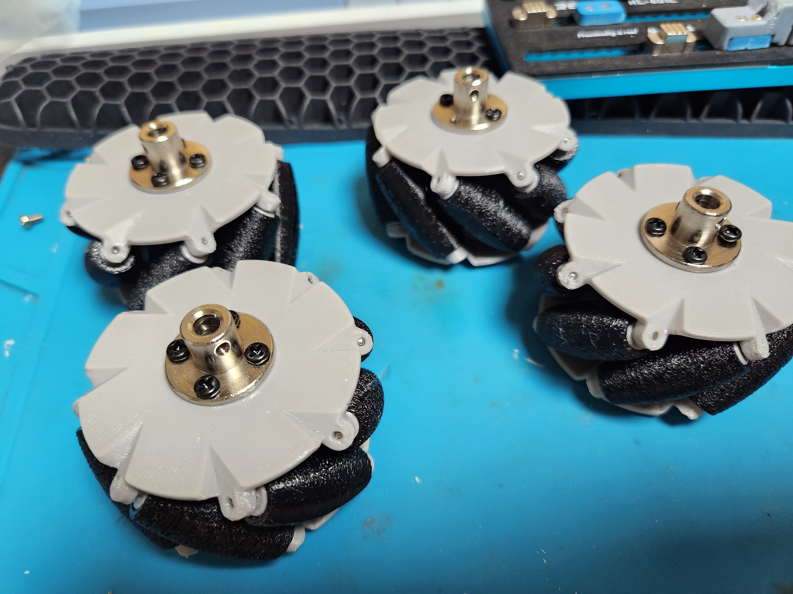
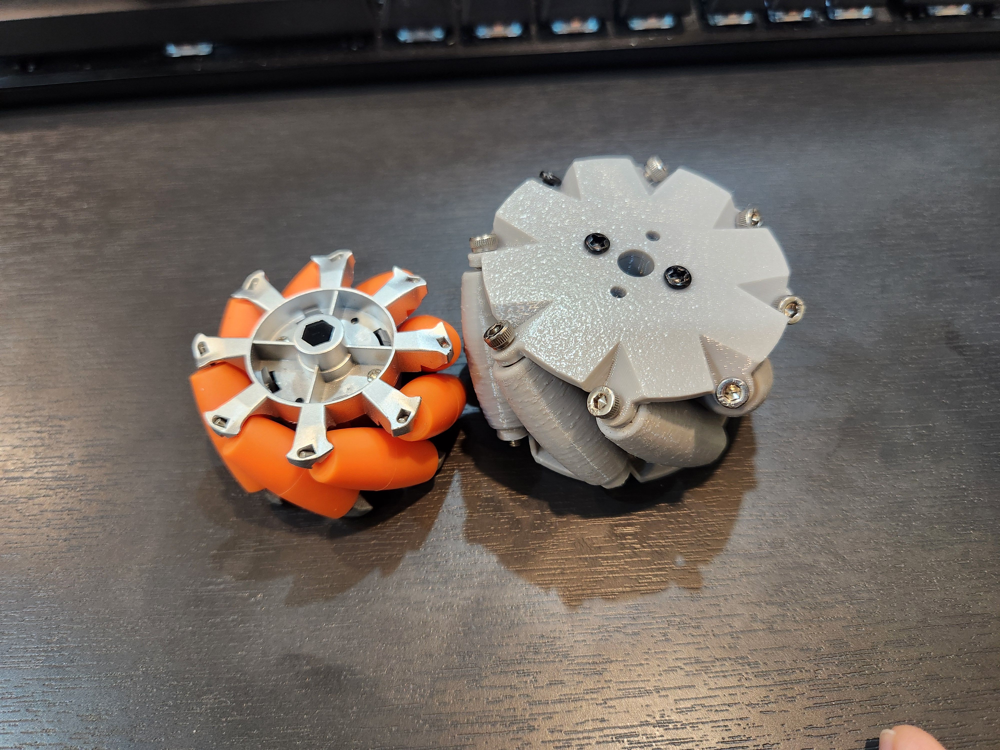
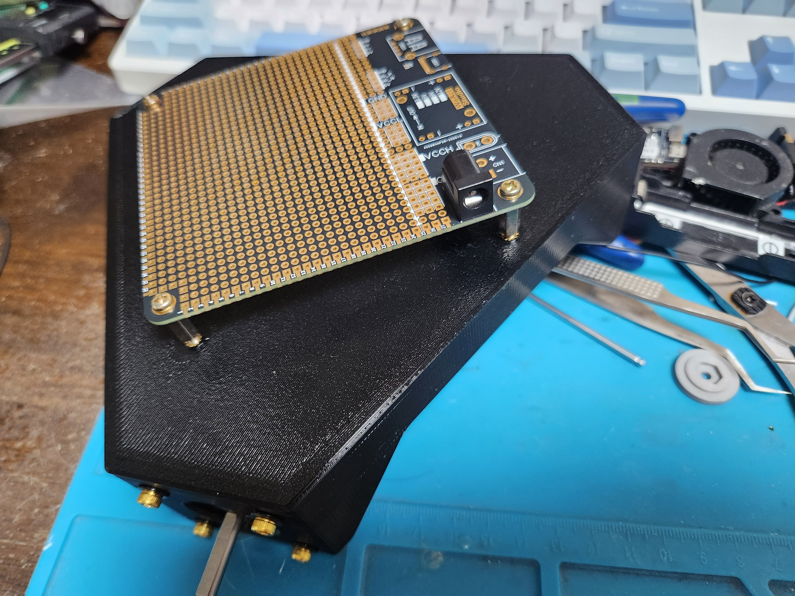
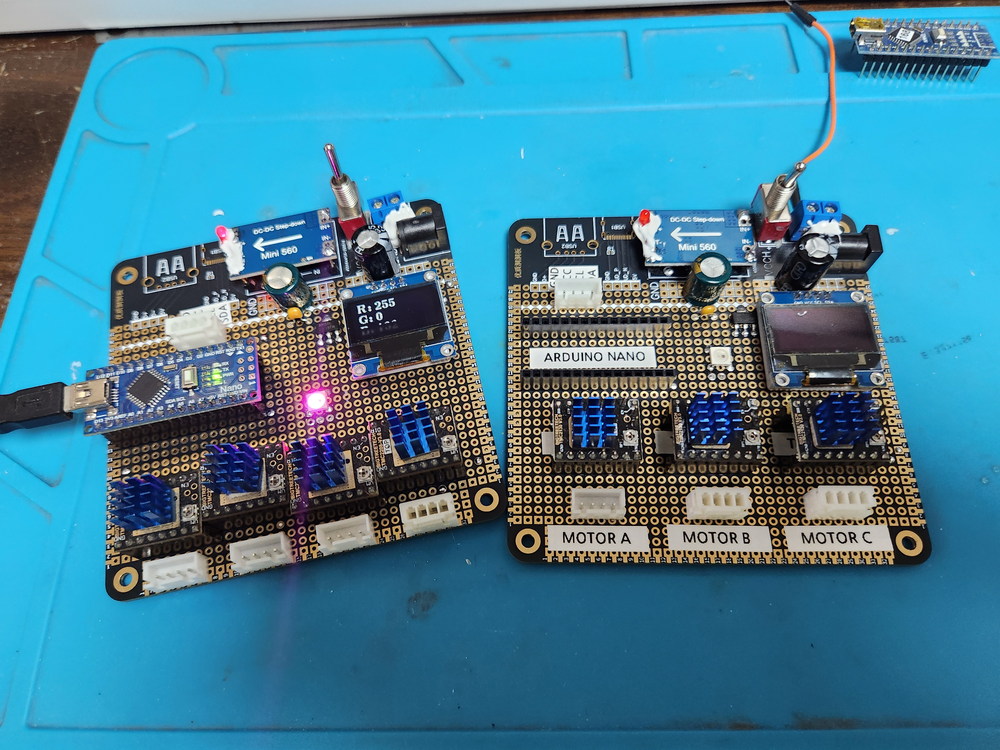

 
 

## 메카넘 휠과 옴니 휠

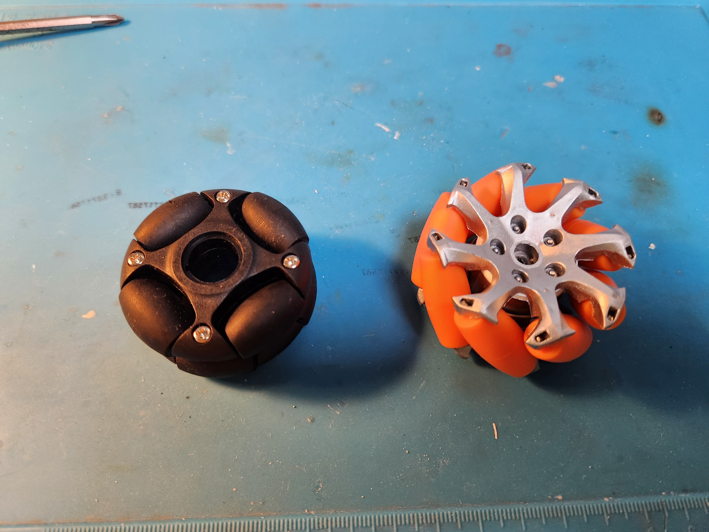

**옴니 휠(Omni Wheel)**(좌측): 

휠 둘레에 수직으로 배치된 작은 롤러를 가진 휠로, 
3개 이상의 휠을 조합하여 전방향 이동이 가능합니다.
 

**메카넘 휠(Mecanum Wheel)**(우측): 

45도 각도로 배치된 롤러를 가진 특수 휠로, 
4개의 휠을 독립적으로 제어하여 전후좌우 이동과 제자리 회전, 대각선 이동이 가능합니다.
 
 

### Kinematics

이 프로젝트는 Wii Nunchaku의 조이스틱과 가속도 센서를 활용하여 메카넘 휠 또는 옴니휠이 장착된 로봇의 전방향 이동을 직관적으로 제어합니다.

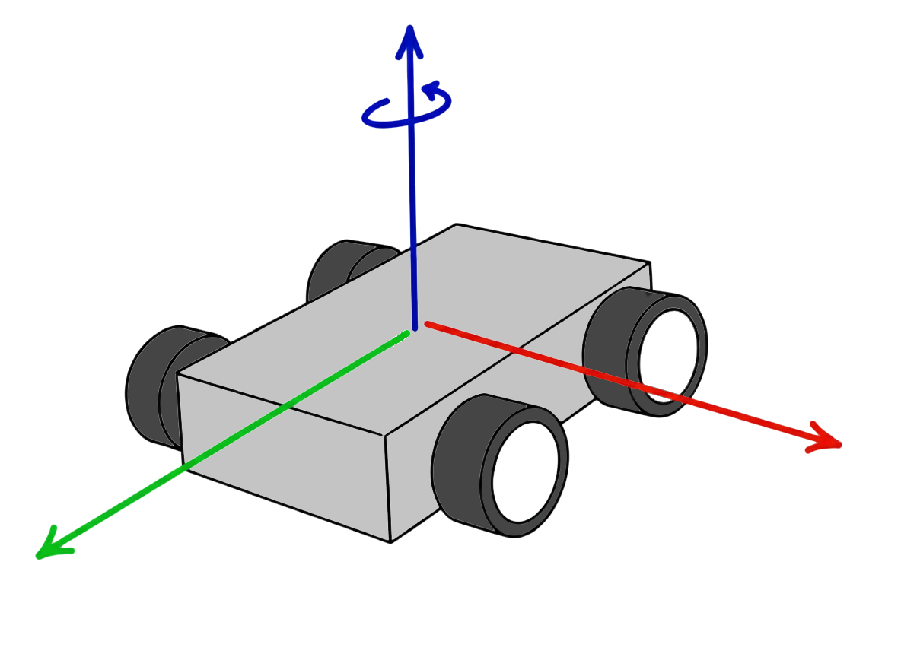

XYZ 3방향 이동과 Z축 회전(yaw)을 조합하여 로봇의 움직임을 제어합니다. 

차체의 거동에 관한 수학적 계산은 [Mecanum_calc.md](Mecanum_calc.md)와 [OmniWheel_calc.md](OmniWheel_calc.md)를 참조하세요.

펌웨어와 하드웨어 검증 항목은 [DEBUG_TODO.md](DEBUG_TODO.md)를 참조하세요.

- **3각형 바디 베이스**: 3개의 스텝모터와 옴니휠
- **4각형 바디 베이스**: 4개의 스텝모터와 메카넘 휠
- ESP32Devkit+Arduino를 이용해 제어
- OLED 디스플레이 포함
- 스텝모터 드라이버: TMC2209

 

### Wii Nunchaku 개요

닌텐도의 Wii Nunchaku는 2006년에 발매된 Nintendo Wii의 조이스틱과 가속도 센서를 포함한 컨트롤러입니다. 
I2C 방식으로 신호를 주고받으며 아두이노 라이브러리를 통해 제어할 수 있습니다. 

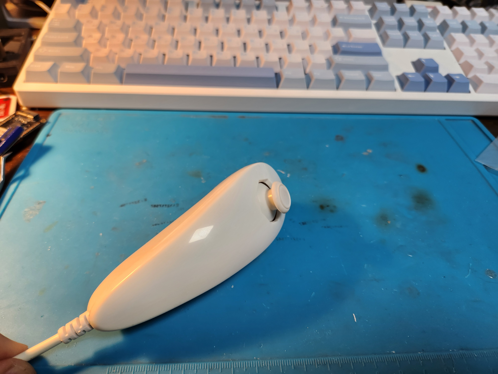

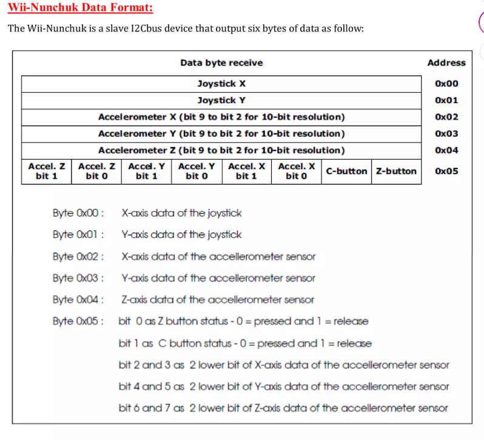

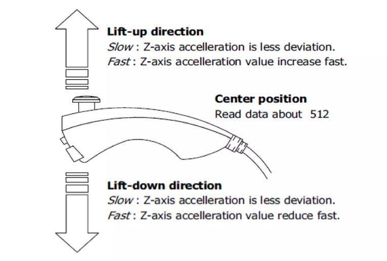

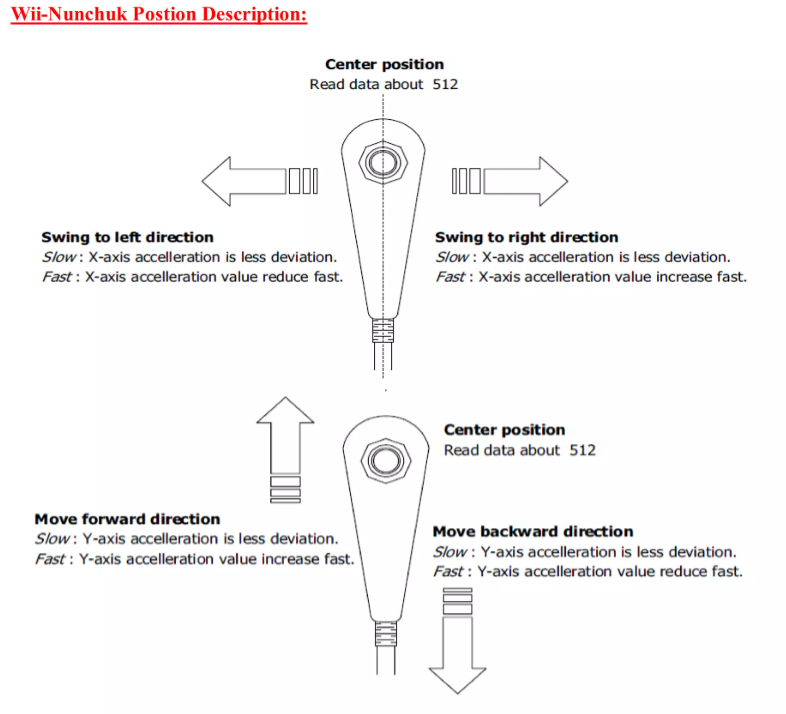

  

# 제작과 조립

## 컨트롤러 및 회로

회로와 회로 제작에 대한 설명은 [Circuit_Design.md](Circuit_Design.md)를 참조하세요.
 

## 3D 하드웨어 및 제작, 조립

자세한 하드웨어 제작 및 조립 과정은 [Hardware_Assembly.md](Hardware_Assembly.md)를 참조하세요.
 

## 테스트 영상

2026.2.4 - XY 이동 테스트 영상
https://www.youtube.com/watch?v=TVuuHdsmRso

 

# 차후 수정 목록

현재 리비전에서는 수정할 수 없어 다음 하드웨어 리비전으로 넘긴 항목입니다.
펌웨어에서 확인 중인 항목은 [DEBUG_TODO.md](DEBUG_TODO.md)를 참조하세요.

### 1. TMC2209 EN 네트에 풀업 저항 추가 (PCB 수정 필요)

4개 드라이버의 공통 EN 핀이 ESP32의 GPIO27에만 연결되어 있고 풀업이 없습니다.
전원 인가부터 `setup()` 진입까지(약 300ms) GPIO27은 입력 플로팅 상태이므로,
이 구간 동안 드라이버의 활성/비활성 상태가 확정되지 않습니다.

- 조치: EN 네트에 **10kΩ 풀업 저항(→ VIO)** 추가
- 효과: 펌웨어가 시작되기 전까지 드라이버가 확실히 비활성 상태로 유지됨
- 참고: 펌웨어 쪽에서는 부팅 직후 출력 래치를 HIGH로 올린 뒤 `pinMode()`를 호출하도록
  이미 수정되어 있으나, `setup()` 진입 이전 구간은 하드웨어로만 해결할 수 있습니다.
- 관련 항목: `DEBUG_TODO.md` P0-2
